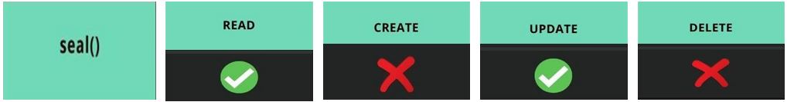
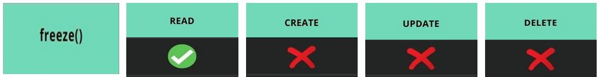

# Mastering in JS Object
## 🎯 Topic-1 : Ways to create Object
### 1. Object literal syntax
<pre>
    const person = {
        firstName: "John",
        lastName: "Doe"
    }
</pre>
### 2. Object constructor
<pre>
    const person1 = new Object();

    // Adding the properties on person1 object
    person1.firstName = "John";
    person1.lastName = "doe";
</pre>

### 3. Constructor Function
<pre>function Student(firstName, lastName) {
    this.firstName = firstName;
    this.lastName = lastName;
}

const Student1 = new Student('Wiliam', 'Gomes');
const Student2 = new Student('Mithila', 'Roy');
</pre>

### 4. Es6 classes (Syntactic sugar)
It's called Syntactic sugar. Because it's internally worked using functions.
<pre>class Person {
    constructor(firstName, lastName) {
        this.firstName = firstName;
        this.lastName = lastName;
    }
}

const person1 = new Person('John', 'Doe');
const person2 = new Person('Jane', 'Doe');
</pre>

### 5. Object.create()
<pre>
    const person1 = {
        name: "John Doe"
    }
    const person2 = Object.create(person1);
    console.log(person2.name);
    // output = John Doe
</pre>

## 🎯 Topic-2 : Object method property
### 1. Object.keys() method :
Object.key() মেথড ব্যবহার করে bottle Object এর সকল property গুলোকে একটি Array তে প্রিন্ট করানো যায়।
<pre>
const bottle = { color: "yellow", price: 50, isCleaned: true, capacity: 1 };
const keys = Object.keys(bottle);
console.log(keys);
// output = [ 'color', 'price', 'isCleaned', 'capacity' ]
</pre>

### 2. Object.values() method :
Object.values() মেথড ব্যবহার করে bottle Object এর সকল value গুলোকে একটি Array তে প্রিন্ট করানো যায়।
<pre>
const bottle = { color: "yellow", price: 50, isCleaned: true, capacity: 1 };
const values = Object.values(bottle);
console.log(values);
// output = [ 'yellow', 50, true, 1 ]
</pre>

### 3. Object.entries() method :
Object.entries() মেথড ব্যবহার এর মাধ্যমে Object কে two Dimesion ভাবে Array তে প্রিন্ট করানো যায়।
<pre>
const bottle = { color: "yellow", price: 50, isCleaned: true, capacity: 1 };
const pair = Object.entries(bottle);
console.log(pair);

// output:
[ ["color", "yellow"], ["price", 50], ["isCleaned", true], ["capacity", 1],]
</pre>
### 🔳 Array এর ভিতর Array থাকাকে Two Dimensional Array বলা হয়।
### 4. Way of delete Object property :
Object এর কোন property কে delete করার জন্য এ delete অপারেটর ব্যবহার করা হয়। 
Syntax :
<pre>
    delete objectName.objectPropertyName;
</pre>
📌 বিস্তারিত - https://developer.mozilla.org/en-US/docs/Web/JavaScript/Reference/Operators/delete 

### 5. Object.seal() method :
Object.seal() method এপ্লাই করলে Object এর property delete ও নতুন property create করা যাবে নাহ্। তবে Object এর property এর value update করা যাবে।
  
Example :
<pre>
const bottle = { color: "yellow", price: 50, isCleaned: true, capacity: 1 };

console.log(bottle);

Object.seal(bottle); // seal method
delete bottle.isCleaned; // delete property
bottle.price = 200; // update property value
bottle.height = 12;  // add new property

console.log(bottle);
</pre>

### 6. Object.freeze() method :
Object.freeze() method এপ্লাই করলে Object কে শুধু Read করা যায়। তবে Object এর property delete, নতুন property create ও property value update করা যাবে নাহ্।

Example :
<pre>
const bottle = { color: "yellow", price: 50, isCleaned: true, capacity: 1 };

console.log(bottle);

Object.freeze(bottle); // freeze method
delete bottle.isCleaned; // delete property
bottle.price = 200; // update property value
bottle.height = 12;  // add new property

console.log(bottle);
</pre>
### 📌 Details about Object :
Link - https://developer.mozilla.org/en-US/docs/Web/JavaScript/Reference/Global_Objects/Object

## 🎯 Topic-3 : Loop through an object using for in, for of, object entries.
🔴 Warning : for of loop can not used with objects ! 
Example :
<pre>
const bottle = { color: "yellow", price: 50, isCleaned: true, capacity: 1 }
for (const key of bottle) {
    console.log(key);
}

// output >> TypeError: bottle is not iterable
</pre>
📌 3 Ways to read object properties :
<pre>
const bottle = { color: "yellow", price: 50, isCleaned: true, capacity: 1 }
bottle.color    // first way
bottle['color'] // second way
bottle[key] // third way
</pre>

### 1️⃣ First option to loop through an object(using for of loop) :
Syntax : ( It's not usefull way ! )
<pre>
const bottle = { color: "yellow", price: 50, isCleaned: true, capacity: 1 }

const keys = Object.keys(bottle);
for (const key of keys) {
    console.log(key, bottle[key]);
}
</pre>
### 2️⃣ Second option to loop through an object(using for in loop) :
Syntax : (It's usefull way)
<pre>
const bottle = { color: "yellow", price: 50, isCleaned: true, capacity: 1 }

for(const key in bottle) {
    const value = bottle[key];
    console.log(key, value);
}
</pre>

### 3️⃣ Third option to loop through an object(using for of loop) :
Syntax : (It's usefull and advanced way)
<pre>
const bottle = { color: "yellow", price: 50, isCleaned: true, capacity: 1 }

const pair = Object.entries(bottle);
for (const [key, value] of Object.entries(bottle)) {
    console.log(key, value);
}
</pre>

## 🎯 Topic-4 : How to Compare objects?
🔴 Warning : do not use this method to compare object or array. 
Example :
<pre>
const first = {a: 2, b: 5, c: 7};
const second = {a: 2, c: 7,b: 5};
const firstString = JSON.stringify(first); // convert object to json string
const secondString = JSON.stringify(second);

function compareObject(first, second){
    const firstKeys = Object.keys(first); // get object properties name
    const secondKeys = Object.keys(second);
    if(firstKeys.length === secondKeys.length) {
        for (const key of firstKeys) {
            const firstkey = first[key];
            const secondKey = second[key];
            if(firstkey !== secondKey) {
                return false;
            }
        }
        return true;
    }
}

const isSame = compareObject(first, second);
console.log(isSame);
</pre>

## 🎯 Topic-4 : JavaScript Borrowing Methods (Borrow method from object and use it on another object)

### 1️⃣ call() Method :
 
Example :
<pre>
const nobin = {
    name : 'Nobin Roy',
    category : 'Junior Developer',
    salary : 35000,
    work: function(){
        return `${this.name} is ${this.category} and his work is frontend development.`;
    },
    remainMoney : function(foodCost, otherExpence) {
        this.salary = this.salary - foodCost - otherExpence;
        return `${this.name} has ${this.salary} taka left.`;
    }
}

const jubin = {
    name: 'Jubin Kapur',
    category : 'Intern Developer',
    salary: '10000'
}

const jubinWork = nobin.work.call(jubin);
const jubinRemainMoney = nobin.remainMoney.call(jubin, 5000, 2000);

console.log(jubinWork);
console.log(jubinRemainMoney); 
</pre>
📝 Note : call method সরাসরি parameter pass করে থাকে ।
 

### 2️⃣ apply() Method :
 
Example :
<pre>
const nobin = {
    name : 'Nobin Roy',
    category : 'Junior Developer',
    salary : 35000,
    work: function(){
        return `${this.name} is ${this.category} and his work is frontend development.`;
    },
    remainMoney : function(foodCost, otherExpence) {
        this.salary = this.salary - foodCost - otherExpence;
        return `${this.name} has ${this.salary} taka left.`;
    }
}

const jubin = {
    name: 'Jubin Kapur',
    category : 'Intern Developer',
    salary: '10000'
}

const jubinWork = nobin.work.apply(jubin);
const jubinRemainMoney = nobin.remainMoney.apply(jubin, [5000, 2000]);
console.log(jubinWork);
console.log(jubinRemainMoney); 
</pre>
📝 Note : apply() method সরাসরি parameter pass করে থাকে এবং parameter এর value "[]"(Array) এর মধ্যে pass করে।
 

### 3️⃣ bind() Method :
 
Example :
<pre>
const nobin = {
    name : 'Nobin Roy',
    category : 'Junior Developer',
    salary : 35000,
    work: function(){
        return `${this.name} is ${this.category} and his work is frontend development.`;
    },
    remainMoney : function(foodCost, otherExpence) {
        this.salary = this.salary - foodCost - otherExpence;
        return `${this.name} has ${this.salary} taka left.`;
    }
}

const jubin = {
    name: 'Jubin Kapur',
    category : 'Intern Developer',
    salary: '10000'
}

const jubinWork = nobin.work.bind(jubin);
const jubinRemainMoney = nobin.remainMoney.bind(jubin);
console.log(jubinWork());
console.log(jubinRemainMoney(5000, 2000)); 
</pre>
📝 Note : bind() Method variableটাকে ফাংশন করে নেয়। তারপর variableটাকে call করে কাজ করা যায় এবং যদি parameter এ কোন value pass করতে হয় তাও করা যায়।
 
> Importent Links :
> https://www.tutorialrepublic.com/javascript-tutorial/javascript-borrowing-methods.php
 
> call() Method - https://developer.mozilla.org/en-US/docs/Web/JavaScript/Reference/Global_Objects/Function/call
 
> apply() Method - https://developer.mozilla.org/en-US/docs/Web/JavaScript/Reference/Global_Objects/Function/apply
 
> bind() Method - https://developer.mozilla.org/en-US/docs/Web/JavaScript/Reference/Global_Objects/Function/bind